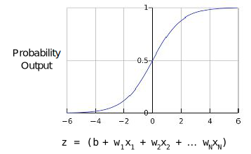

# Logistic Regression

## Calculating a Probability
* Logistic regression is used for calculating probabilities
* Uses sigmoid function 1/(1+e-z) s.t. z = b+wTx
	* `z` is also known as log-odds b/c `z = log(y/(1-y))` i.e. log of prob of 1 label divided by probability of 0 label. 
* sigmoid function guarantees that the output falls between 0 and 1

## Loss and Regularization
* Logistic regression uses log loss instead of squared loss as the objective function
	* Log Loss = `Summation (-y log(y') - (1-y)log(1-y')`
		* `y` = true label
		* `y'` = predicted label
* Logistic regression is asymptotic on each end - never reaches 1 or 0
* Regularization is necessary in Logistic Regression b/c its asymptotic nature will drive loss towards 0 in higher dimensions (??)
	* L2 regularization
	* early stopping

## Follow Ups 
* Q: Why does logistic regression's asymptotic nature require regularization?

## Resources

* Course Links: 
	* Calculating a Probability https://developers.google.com/machine-learning/crash-course/logistic-regression/calculating-a-probability
	* Loss and Regularization https://developers.google.com/machine-learning/crash-course/logistic-regression/model-training